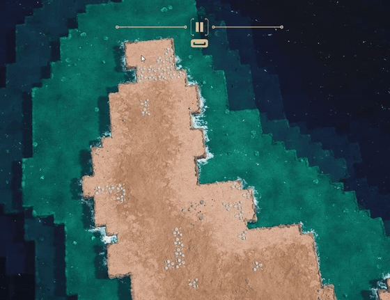

# OreSweep

An ore-only mining mod for [Whiskerwood](https://store.steampowered.com/app/2489330/Whiskerwood/).

Hold **Ctrl** while you release a mining-tool drag. Only the cells that contain ore (gold, copper, tin, iron, coal, rock salt, potash, ...) get marked. Plain stone is skipped. Without Ctrl the mining tool works exactly as before.



In the demo, Ctrl-drags over an island mark only the ore veins; the stone around them is left alone.

## Features

- **Sweep a big area, mine only the ore.** Drag across a whole hillside and your mice dig out the ore veins without tunnelling through all the stone around them.
- **No peeking.** Cells you haven't surveyed yet are skipped too, because the game doesn't show you what's in them (you can change this in the ini).
- **Configurable hotkey** and an on/off switch in `OreSweep.ini`.
- **Update-safe.** The mod finds the game code it needs when the game starts. If a game update changes that code, the mod quietly switches itself off (Ctrl-drags then mark everything as normal). It doesn't crash the game.

The preview while you drag (the highlighted cells and the tooltip counts) still includes the stone. The filter is applied when you release the mouse, and after that only the ore cells are marked.

## Installing

1. Close the game.
2. Copy `dsound.dll` and `OreSweep.ini` into the folder that contains `Whiskerwood-Win64-Shipping.exe`:
   `...\steamapps\common\Whiskerwood\Whiskerwood\Binaries\Win64\`
   (In Steam: right-click Whiskerwood → Manage → Browse local files, then open `Whiskerwood\Binaries\Win64`.)
3. Start the game and hold Ctrl while releasing a mining drag.

**Uninstalling:** delete `dsound.dll` and `OreSweep.ini`.

This is a native mod: it is not a `.pak` and is not listed in the in-game Mods tab. The game loads it because it is named `dsound.dll`. It forwards all real DirectSound calls to Windows' own `dsound.dll`, so sound is unaffected.

## Settings (`OreSweep.ini`)

| Key | Default | Meaning |
|---|---|---|
| `Enabled` | `1` | `0` turns the mod off. |
| `HotkeyVK` | `17` (Ctrl) | Key to hold, as a Windows virtual-key code. Avoid `18` (Alt moves the camera) and `16` (Shift is used by the game). `20` = Caps Lock; a letter's ASCII code also works, e.g. `90` = Z. |
| `KeepUnsurveyed` | `0` | `1` also marks unsurveyed cells. |

Settings are read once, when the game starts.

## Repository layout

| Path | What |
|---|---|
| `src/main.c` | The mod: DLL entry, config, signature scan, the cell filter. |
| `src/stubs.S` | The DirectSound forwarders and the hook trampoline (assembly). |
| `src/dsound.def` | The DLL's exports (all 12 DirectSound functions, same ordinals as Windows). |
| `src/kernel32.def`, `src/user32.def` | Import lists used to generate import libraries, so no Windows SDK is needed. |
| `dist/OreSweep.ini` | Default settings file shipped with the dll. |
| `build.sh` | Build script, output goes to `build/`. |
| `docs/internals.md` | Reverse-engineering notes: what the hook patches and why. |
| `docs/demo.gif` | The demo shown at the top of this README. |

## Building from source

Needs LLVM (clang, lld-link and llvm-dlltool, version 15 or newer). Visual Studio, the Windows SDK and MinGW are not needed.

```sh
./build.sh
```

This works on Linux, WSL, or Git Bash on Windows with [LLVM for Windows](https://github.com/llvm/llvm-project/releases) on the PATH. The result is `build/dsound.dll` plus a copy of `OreSweep.ini`.

## How it works

The game's mining selection and terrain data are compiled C++, and Blueprint mods can't read or change them, so this can't be done with the official modkit. OreSweep hooks the game function that turns your drag selection into mining orders. For each selected cell, when the hotkey is held, it looks the cell up in the terrain grid and drops the order if the cell is plain stone or unsurveyed. Details are in [docs/internals.md](docs/internals.md).

Built for game version 0.7.207. Later versions work as long as the patched code hasn't changed. If Ctrl-drags stop filtering after an update, the patched code has changed and the mod needs updating.

## Credits

Made by ringuh.
